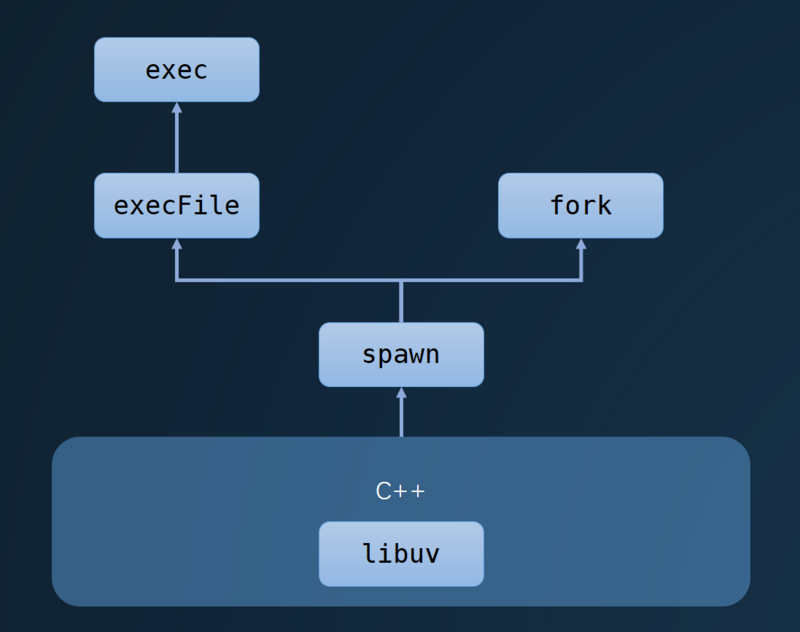

---
nav:
  title: 系统
  order: 3
group:
  title: 进程
  order: 1
title: 子进程
order: 2
---

# 子进程

子进程 (Child Process) 是进程中一个重要的概念。我们可以通过 Node.js 的 `child_process` 模块衍生出一个子进程，并且父子进程使用一个消息系统相互之间可以很容易地交流。

`child_process` 模块使我们在一个运行良好的子进程内运行一些能够进入操作系统的命令。

父进程可以控制子进程的输入流，并且监听它的输出流。也可以控制传递给潜在的操作系统命令的参数，我们可以通过那个命令的输出做我们想做的事情。比如：可以将一个命令的输出作为另一个的输入，因为哪些命令的输入和输出都是使用流的形式呈现给我们。

## 创建子进程

Node.js 的 child_process 内置模块提供了几种创建子进程的四种方式：

- `child_process.spawn()`：适用于返回大量数据，例如图像处理，二进制数据处理
- `child_process.exec()`：适用于小量数据，maxBuffer 默认值为 200 \* 1024 超出这个默认值将会导致程序崩溃，数据量过大可采用 spawn
- `child_process.execFile()`：类似 `child_process.exec()`，区别是不能通过 shell 来执行，不支持像 I/O 重定向和文件查找这样的行为
- `child_process.fork()`：衍生新的进程，进程之间是相互独立的，每个进程都有自己的 V8 实例、内存，系统资源是有限的，不建议衍生太多的子进程出来，通常根据系统 CPU 核心数设置

### spawn

```
child_process.spwan(command [, args] [, options])
```

创建父子进程间通信的三种方式：

- 让子进程的 stdio 和当前进程的 stdio 之间建立管道链接 `child.stdout.pipe(process.stdout)`
- 父进程子进程之间共用 stdio
- 事件监听

```js
const spawn = require('child_process').spawn;
// cwd 指定子进程的工作目录，默认当前目录
const child = spwan('ls', ['-l'], { cwd: '/usr' });

child.stdout.pipe(process.stdout);
console.log(process.pid, child.pid);
// 主进程ID 3243 子进程ID 3244
```

通过 spawn 创建的子进程，继承自 EventEmitter，所以可以在上面进行事件（`discount`、`error`、`close`、`message`）的监听。同时子进程具有三个输入输出流：stdin、stdout、stderr，通过这三个流，可以实时获取子进程的输入输出和错误信息。

> 这个方法的最终实现基于 libuv，参考[源码](https://github.com/nodejs/node/blob/v10.14.2/src/process_wrap.cc#L256)
>
> ```cpp
> // 调用 libuv 的 api，初始化一个进程
> int err = uv_spawn(env->event.loop(), $wrap->process_, $options);
> ```

### exec

`exec` 最终调用的就是下面的 `execFile` 方法（[源码](https://segmentfault.com/a/1190000017804200#)）。唯一区别是，`exec` 中调用的 `normalizeExecArgs` 方法会将 opts 的 shell 属性默认设置为 `true`。

`exec` 会将 spawn 的输入输出流转换为字符串，默认使用 UTF-8 的编码，然后传递给回调函数，使用回调方式在 Node.js 中较为熟悉，比流更容易操作，所以我们能使用 `exec` 方法执行一些 Shell 命令，然后在回调中获取返回值。有点需要注意，这里的 buffer 是有最大缓存区的，如果超出会直接被 kill 掉，可用通过 `maxBuffer` 属性进行配置（默认：200 \* 1024）。

```js
const exec = require('child_process').exec;

execFile(`node`, (error, stdout, stderr) => {
  console.log({ error, stdout, stderr });
  // { error: null, stdout: 'v8.5.0\n', stderr: '' }
});
```

### execFile

```js
const execFile = require('child_process').execFile;

execFile(`node`, ['-v'], (error, stdout, stderr) => {
  console.llog({ errpr, stdout, stderr });
  // { error: null, stdout: 'v8.5.0\n', stderr: '' }
});
```

### fork

`fork` 最后也是调用 `spwan` 来创建子进程，但是 `fork` 是 `spawn` 的一种特殊情况，用于衍生新的 Node.js 进程，会产生一个新的 V8 实例，所以执行 `fork` 方法时需要指定一个 JS 文件。

```js
const fork = require('child_process').fork;
fork('./worker.js'); // fork 一个新的子进程
```

通过 `fork` 创建子进程之后，父子进程直接会创建一个 IPC（进程间）通道，方便父子进程直接通信，在 JS 层使用 `process.send(message)` 和 `process.on('message', msg => {})` 进行通信。二在底层，实现进程间通信的方式有很多，Node.js 的进程间通信基于 libuv 实现，不同操作系统实现方式不一致，在 \*unix 系统中采用 Unix Domain Socket 方式实现，Windows 中使用命名管道的方式实现。

常见进程间通信方式：

- 消息队列
- 共享内存
- `pipe`
- 信号量
- 套接字

可以看到，这些方法都是对 `spawn` 方法的复用，然后 `spawn` 方法底层调用 libuv 进行进程的管理。



### 异步 vs 同步

大部分时候，子进程的创建是异步的。也就是说，它不会阻塞当前的事件循环，这对于性能的提升很有帮助。

当然，有的时候，同步的方式会更方便（阻塞事件循环），比如通过子进程的方式来执行 shell 脚本时。

Node.js 同样提供同步的版本：

- `spawnSync()`
- `execSync()`
- `execFileSync()`

## 应用场景

子进程的应用场景：

- 计算密集型系统
- 前端构建工具利用多核 CPU 并行计算，提升构建效率
- 进程管理工具，如：PM2 中部分功能

## 孤儿进程和僵尸进程

> 经典面试题：父进程或子进程的死亡是否会影响对方? 什么是孤儿进程?

子进程死亡不会影响父进程，不过子进程死亡时（线程组的最后一个线程，通常是「领头」线程死亡时），会向它的父进程发送死亡信号。反之父进程死亡，一般情况下子进程也会随之死亡。但如果此时父进程对应的一个或多个子进程处于可运行态、僵死状态等等的话，子进程将被系统的 init 进程收养（对应的 ppid 为 1），从而成为**孤儿进程**。

另外，子进程死亡的时候（处于“终止状态”），父进程没有及时调用 `wait()` 或 `waitpid()` 来返回死亡进程的相关信息，此时子进程还有一个 PCB 残留在进程表中，被称作**僵尸进程**。

🌰 **孤儿进程 示例代码**

<<< @/example/child-process/orphan-process/master.js

<<< @/example/child-process/orphan-process/worker.js

控制台进行调试，输出当前工作进程 pid 和父进程 ppid

```bash
$ node master
worker process created, pid: 32971 ppid: 32970
```

由于在 master.js 里退出了父进程，活动监视器所显示的也就只有工作进程。

再次验证，打开控制台调用接口，可以看到工作进程 32971 对应的 ppid 为 1（为 init 进程），此时已经成为了孤儿进程。

```bash
$ curl http://127.0.0.1:3000
I am worker, pid: 32971, ppid: 1
```

---

**参考资料：**

- [📝 Node.js 子进程：你需要知道的一切](https://zhuanlan.zhihu.com/p/36678971)
- [📝 Node.js 的进程管理](https://segmentfault.com/a/1190000017804200)
- [📝 Node.js 子进程与应用场景](https://blog.csdn.net/weixin_34161029/article/details/87998135)
