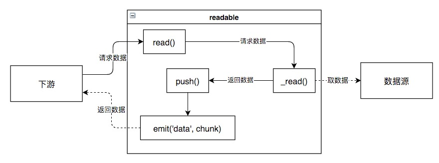

# 流

流（stream）是 Node.js 中处理流式数据的抽象接口。`stream` 模块用于构建实现了流接口的对象。

流也是一种数据传输手段，是有顺序的，是有起点和终点的，比如你要把数据从一个地方传到另一个地方。

Node.js 提供了多种流对象。例如，HTTP 服务器的请求 和 [`process.stdout`]() 都是流的实例。

流是可读的、可写的、或者可读可写的。**所有的流都是 EventEmitter 的实例。**

为什么流那么好用还那么重要呢？

- 因为有时候我们并不需要关心文件的主体内容，只关心能不能取到数据，取到数据之后怎么进行处理
- 对于小型的文本文件，我么你可以把文件内容全部读入内存，然后再写入文件，比如 `grunt-file-copy`
- 对于体积较大的二进制文件，比如音频、视频文件，动辄几个 GB 大小，如果使用这种方法，很容易使内存溢出
- 理想的方法应该是读一部分，写一部分，不管文件有多大，只要时间允许，总会处理完成，这里就需要用到流的概念

访问 `stream` 模块。

```js
const stream = require('stream');
```

尽管理解流的工作方式很重要，但是 `stream` 模块主要用于开发者创建新类型的流实例。 对于以消费流对象为主的开发者，极少需要直接使用 `stream` 模块。

## 流的类型

在 Node.js 中有四种基本的流类型：

- `Writable`（可写流）：可写流是数据可以被写入目标的抽象（例如 `fs.createWriteStream()`）
- `Readable`（可读流）：可读流是数据可以被消费的抽象（例如 `fs.createReadStream()`）
- `Duplex`（双向流）：双向流既是可写的也是可读的（例如 `net.Socket`）
- `Transform`（转换流）：转向流基于双向流，可以在读或写的时候被用来更改或者转换数据（例如 `zlib.createDeflate()` 使用 gzip 算法压缩数据）。可以将转换流想象成一个函数，它的输入是可写流，输出是可读流。某些地方也将转换流称为通过流（through streams）

所有流都是 EventEmitter 的实例。触发它们的事件可以读或者写入数据，然而，我们可以使用 `pipe` 方法消费流的数据。

此外，该模块还包括实用函数 `stream.pipeline()`、`stream.finished()` 和 `stream.Readable.from()`。

### 对象模式

Node.js 创建的流都是运作在字符串和 Buffer（或 Uint8Array）上。 当然，流的实现也可以使用其它类型的 JavaScript 值（除了 null）。 这些流会以 `对象模式` 进行操作。

当创建流时，可以使用 `objectMode` 选项把流实例切换到对象模式。 将已存在的流切换到对象模式是不安全的。

### 缓冲

`可写流` 和 `可读流` 都会在内部的缓冲器中存储数据，可以分别使用的 `writable.writableBuffer` 或 `readable.readableBuffer` 来获取。

可缓冲的数据大小取决于传入流构造函数的 `highWaterMark` 选项。 对于普通的流， `highWaterMark` 指定了字节的总数。 对于对象模式的流， `highWaterMark` 指定了对象的总数。

当调用 `stream.push(chunk)` 时，数据会被缓冲在可读流中。 如果流的消费者没有调用 `stream.read()`，则数据会保留在内部队列中直到被消费。

一旦内部的可读缓冲的总大小达到 `highWaterMark` 指定的阈值时，流会暂时停止从底层资源读取数据，直到当前缓冲的数据被消费 （也就是说，流会停止调用内部的用于填充可读缓冲的 `readable._read()`）。

当调用 `writable.write(chunk)` 时，数据会被缓冲在可写流中。 当内部的可写缓冲的总大小小于 `highWaterMark` 设置的阈值时，调用 `writable.write()` 会返回 `true`。 一旦内部缓冲的大小达到或超过 `highWaterMark` 时，则会返回 `false`。

stream API 的主要目标，特别是 `stream.pipe()`，是为了限制数据的缓冲到可接受的程度，也就是读写速度不一致的源头与目的地不会压垮内存。

因为 Duplex 和 Transform 都是可读又可写的，所以它们各自维护着两个相互独立的内部缓冲器用于读取和写入， 这使得它们在维护数据流时，读取和写入两边可以各自独立地运作。 例如，net.Socket 实例是 Duplex 流，它的可读端可以消费从 socket 接收的数据，而可写端则可以将数据写入到 socket。 因为数据写入到 socket 的速度可能比接收数据的速度快或者慢，所以读写两端应该独立地进行操作（或缓冲）。

## 可读流 Readable Streams

在 Node.js 中属于可读流的具体实现形式：

- 客户端的 HTTP 响应
- 服务端的 HTTP 请求
- `fs` 模块的 read streams 读取流
- `zlib` 压缩流
- `crypto` 加密流
- TCP Sockets
- 子进程 stdout 与 stderr 子进程标准输出和错误输出
- process.stdin 标准输入

所有的 Readable 都实现了 `stream.Readable` 类定义的接口。

```js
const Readable = stream.Readable;
```

实现了 `stream.Readable` 接口的对象，将对象的数据读取为流数据，当监听 `data` 事件后，开始发射数据。

🌰 **示例：读取文件流创建**

```js
const rs = fs.createReadStream(path, {
    // 打开文件要做的操作，默认 'r'
    flags: 'r',
    encoding: null,
    // 开始读取的索引位置
    start: '0',
    // 结束读取的索引位置（包括结束位置）
    end: '',
    // 读取缓存区默认的大小的阀值 64KB
    highWaterMark: ''
})

// 监听 data 事件，流自动切换到流动模式
// 数据会尽可能快地读出
rs.on('data', function(data){
    console.log(data);
});

// 数据读取完毕后触发 end 事件
rs.on('end', function(){
    consolel.log('读取完毕')
});

// 可读流打开事件
rs.on('open', function(){
    consolel.log('读取完毕')
});

// 可读流关闭事件
rs.on('close', function(er){
    console.log('')
})；

// 指定编码和上面创建流时的参数 encoding 意思相同
rs.setEncoding('utf8');

rs.on('data', function(data){
    // 可读流暂停读取
    rs.pause();
    console.log(data);
});

setTimeout(function(){
    // 可读流恢复读取
    rs.resume();
}, 2000);
```

### 读取模式

Readable Stream 存在两种模式**流动模式**（flowing mode）和**暂停模式**（paused mode），这两种模式决定了 chunk 数据流动的方式：自动流动和手工流动。

可读流对象 Readable 中有一个维护状态的对象，`readable._readableState`，这里简称为 `state`。其中有一个标记，`state.flowing`，可用来判别流的模式。它有三种可能值：

- `true` 表示流动模式
- `false` 表示暂停模式
- `null` 初始状态

1. **流动模式**（flowing mode）：数据会源源不断地生产出来，形成**流动**现象。监听流的 `data` 事件便可进入该模式
2. **暂停模式**（paused mode）：需要显示地调用 `read()`，触发 `data` 事件。在初始状态下，监听 `data` 事件，会使流进入流动模式。但如果在暂停模式下，监听 `data` 事件并不会使它进入流动模式。为了消耗流，需要显示调用 `read()` 方法。
3. **相互转化**
   - 调用 `readable.resume()` 可使流进入流动模式，`state.following` 被设为 `true`
   - 调用 `readable.pause()` 可使流进入暂停模式，`state.flowing` 被设为 `false`

那么如何触发这两种模式呢：

- flowing mode
  - 注册事件 `data`
  - 调用 `resume` 方法
  - 调用 `pipe` 方法
- paused mode
  - 调用 `pause` 方法（没有 `pipe` 方法）
  - 移除 `data` 事件
  - `unpipe` 所有 `pipe`

如果 Readable 切换到 flowing 模式，且没有消费者处理流中的数据，这些数据将会丢失。比如，调用了 `readable.resume()` 方法切没有监听 `data` 事件，或是取消 `data` 事件监听，就有可能出现这种情况。

### 原理

创建可读流时，需要集成 Readable 对象，并实现 `_read` 方法。



`_read` 方法是从底层系统读取具体数据的逻辑，即生产数据的逻辑

在 `_read` 方法中，通过调用 `push(data)` 将数据放入可读流中供下游消耗。在 `_read` 方法中，可以同步调用 `push(data)`，也可以异步调用。当全部数据都生产出来后，必须调用 `push(null)` 来结束可读流。流一旦结束，便不能再调用 `push(data)` 添加数据。可以通过监听 `data` 事件的方式消耗可读流。

在首次监听其 `data` 事件后，readable 便会持续不断地调用 `_read()`，通过触发 `data` 事件将数据输出。第一次 `data` 事件会在下一个 tick 中触发，所以，可以安全地将数据输出前的逻辑放在事件监听后（同一个 tick 中）。当数据全部被消耗时，会触发 `end` 事件。


通过流读取数据

- 用 Readable 创建实例对象 readable 后，便得到了一个可读流
- 如果实现 `_read` 方法，就将流连接到一个底层数据源
- 流通过调用 `_read` 向底层请求数据，底层再调用流的 `push` 方法将需要的数据传递过来
- 当 readable 连接了数据源后，下游便可以调用 `readable.read(n)` 向流请求数据，同时监听 readable 的 `data` 事件来接收取到的数据

### doRead

流中维护了一个缓存，当缓存中的数据足够多时，调用 `read()` 不会引起 `_read()` 的调用，即不需要向底层请求数据。用 `doRead` 来表示 `read(n)` 是否需要向底层取数据。

```js
const doRead = state.needReadable;

if (state.length === 0 || state.length - n < state.highWaterMark) {
  doRead = true;
}

if (state.ended || statte.reading) {
  doRead = false;
}

if (doRead) {
  satte.reading = true;
  state.sync = true;
  if (state.length === 0) {
    state.needReadable = true;
  }
  this._read(state.highWaterMark);
  state.sync = false;
}
```

当缓存区的长度为 0 或者缓存区的数量小于 `state.highWaterMark` 这个阀值，则会调用 `_read()` 去底层读取数据。`state.reading` 标志上次从底层取数据的操作是否完成，一旦 `push` 被调用，就会就会设置 `false`，表示此次 `_read()` 结束。

### push

消耗方调用 `read(n)` 促使流输出数据，而流通过 `_read()` 使底层调用 `push()` 方法将数据传给流。如果调用 `push` 方法时缓存为空，则当前数据即为下一个需要的数据。这个数据可能先添加到缓存中，也可能直接输出。执行 `read` 方法时，在调用 `_read` 后，如果从缓存中取到了数据，就以 `data` 事件输出。

所以，如果 `_read` 异步调用 `push` 时发现缓存为空，则意味着当前数据是下一个需要的数据，且不会被 `read` 方法输出，应当在 `push` 方法中立即以 `data` 事件输出。

```js
state.flowing && state.length === 0 && !state.sync;
```

### end

由于流是分次向底层请求数据的，需要底层显示地告诉流数据是否取完。所以，当某次（执行 `_read()`）取数据时，调用了 `push(null)`，就意味着底层数据取完。此时，流会设置 `state.ended`。

`state.length` 表示缓存中当前的数据量。只有当 `state.length` 为 0，且 `state.ended` 为 `true`，才意味着所有的是数据都被消耗了。一旦在执行 `read(n)` 时检测到这个条件，便会触发 `end` 事件。当然，这个事件只会触发一次。

### readable

在调用完 `_read()` 后，`read(n)` 会试着从缓存中取数据。如果 `_read()` 是异步调用 `push()` 方法的，则此时缓存中的数据量不会增多，容易出现数据量不够的现象。

如果 `read(n)` 的返回值为 `null`，说明这次未能从缓存中取出所需量的数据。此时，消耗方需要等待新的数据到达后再次尝试调用 `read` 方法。

在数据到达后，流是通过 readable 事件来通知消耗方。在此种情况下，`push` 方法如果立即输出数据，接收方直接监听 `data` 事件即可，否则数据被添加到缓存中，需要触发 readable 事件。消耗方必须监听这个事件，再调用 `read` 方法取得数据。


## 可写流 Writable Streams

可写流是对数据写入目的地的一种抽象。

在 Node.js 中属于可读流的接口：

- HTTP Request on the client 客户端请求
- HTTP Response on the server 服务器响应
- fs write streams 文件
- zlib streams 压缩
- crypto streams 加密
- TCP sockets TCP 服务器
- child process stdin 子进程标准输入
- process.stdout / process.stderr 标准输出，错误输出

## 双工流 Duplex Streams

Duplex 实际上就是继承了 Readable 和 Writable 的一类流。所以，一个 Duplex 对象既可当成可读流来使用（需要实现 `_read` 方法），也可当成可写流来使用（需要实现 `_write` 方法）。

## 转换流 Transform Streams

变换流（Transform Streams）是一种 Duplex 流。它的输出与输入是通过某种方式关联。和所有 Duplex 流一样，变换流同时实现了 Readable 和 Writable 接口。

对于转换流，我们不必实现 `read` 或 `write` 方法，我们只需要实现一个 `transform` 方法，将两者结合起来。它有 `write` 方法的意思，我们也可以用它来 `push` 数据。

变换流的实例包括：

- zlib streams
- crypto streams

```js
const { Transform } = require('stream');
const upperCase = new Transform({
  transform(chunk, encoding, callback) {
    this.push(chunk.toString().toUpperCase());
    callback();
  },
});

process.stdin.pipe(upperCase).pipe(process.stdout);
```

---

**参考资料：**

- [📝 Node.js 流（stream）：你需要知道的一切](https://zhuanlan.zhihu.com/p/36728655)
- [通过源码解析 Node.js 中导流（pipe）的实现](https://cnodejs.org/topic/56ba030271204e03637a3870)
- [](https://juejin.im/post/5d25ce36f265da1ba84ab97a)
- [zoubin/streamify-your-node-program：对 Node.js 中 stream 模块的学习积累和理解](https://github.com/zoubin/streamify-your-node-program)