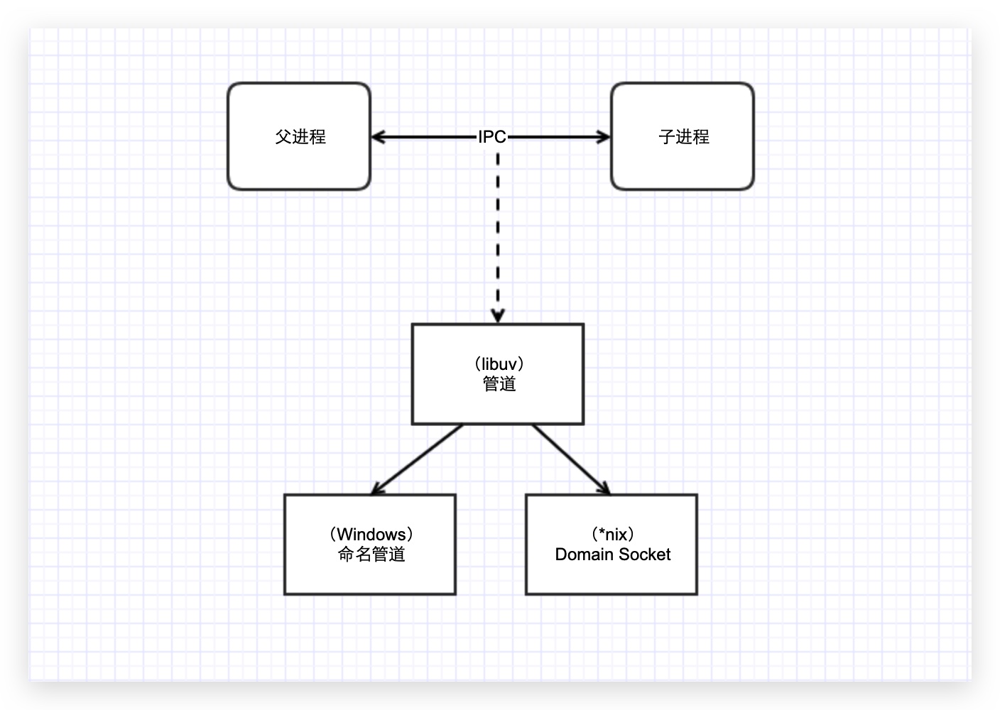
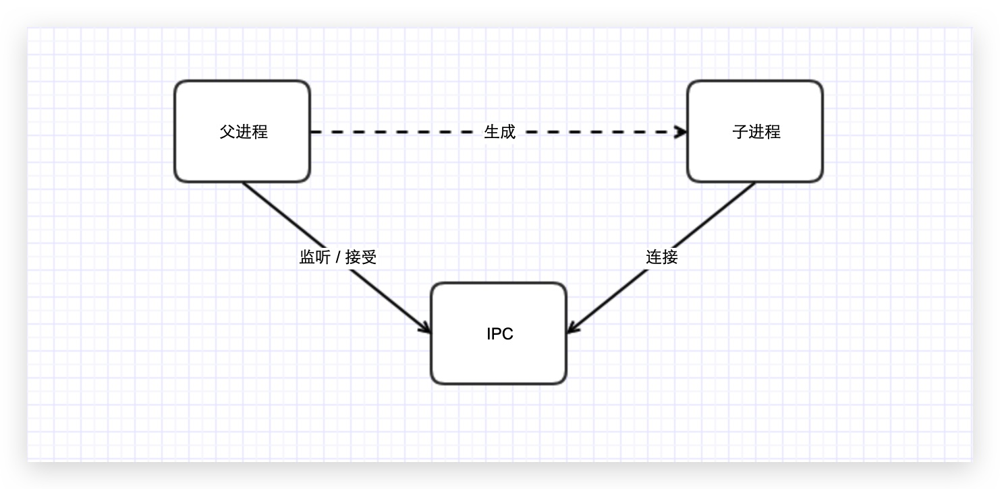
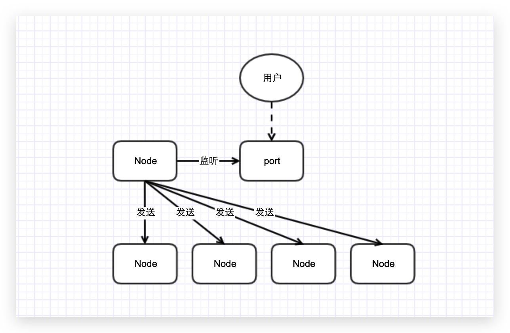
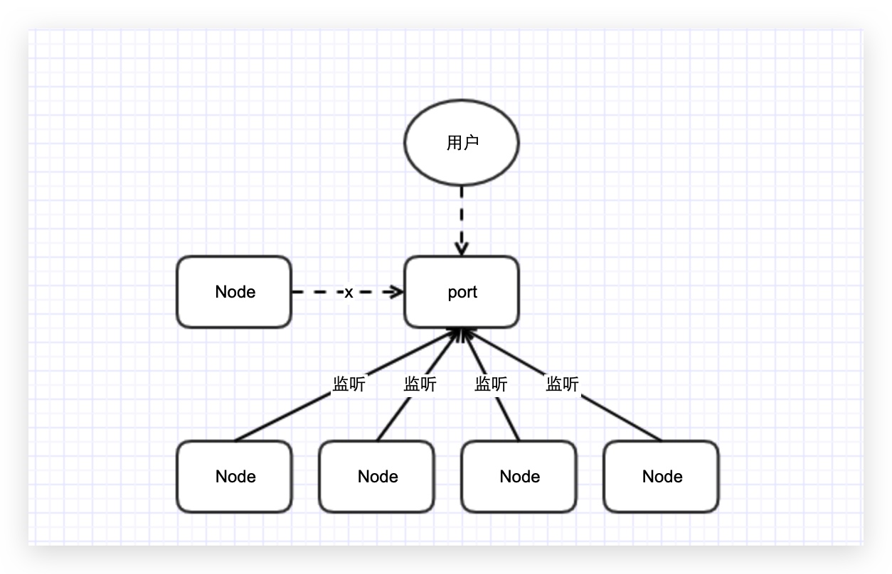

# 进程间通信

1. 什么是 IPC 通信？
2. 如何建立 IPC 通信？
3. 什么场景下需要用到 IPC 通信？

## 概念

IPC（Inter-process communication），即进程间通信技术，由于每个进程创建之后都有自己的独立地址空间，实现 IPC 的目的就是为了进程之间资源共享访问。

操作系统的进程间通信方式主要有以下几种：

- **共享内存**：不同进程共享同一段内存空间。通常还需要引入信号量机制，来实现同步和互斥。
- **消息传递**：这种模式下，进程间通过发送、接收消息来实现信息的同步。
- **信号量**：信号量简单说就是系统赋予进程的一个状态值，未得到控制权的进程会在特定地方被迫停下来，等待可以继续进行的信号到来。如果信号量只有 0 或者 1 两个值的话，又被称作「互斥锁」。这个机制也被广泛用于各种编程模式中。
- **管道**：管道本身也是一个进程，它用于连接两个进程，将一个进程的输出作为另一个进程的输入。可以用 pipe 系统调用来创建管道。我们进程用的 `|` 命令行就是利用管道机制。

## 实现原理

Node.js 中实现 IPC 通道的是管道（pipe）技术。但此管道并非彼管道，在 Node.js 中管道是个抽象层面的称呼，具体细节实现由 libuv 提供，在 Windows 下由命名管道（named pipe）实现，\*nix 系统则采用 Unix Domain Socket 实现。表现在应用层上的进程间通信只有简单的 `message` 事件和 `send()` 方法，接口十分简洁和消息化。



父进程在实际创建子进程之前，会创建 IPC 通道并监听它，然后才真正创建出子进程，并通过环境变量（NODE_CHANNEL_FD）告诉子进程这个 IPC 通道的文件描述符。子进程在启动的过程中，根据文件描述符去连接这个已存在的 IPC 通道，从而完成父子进程之间的连接。



建立连接之后的父子进程就可以自由地通信了。由于 IPC 通道是用明明管道或 Domain SOcket 创建的，它们与网络 socket 的行为比较类似，属于双向通信。不同的是它们在系统内核中就完成了进程间的通信，而不同经过实际的网络层，非常高效。在 Node 中，IPC 通道被抽象为 Stream 对象，在调用 `send()` 时发送数据（类似于 `write()`）接收到的消息会通过 `message` 事件（类似于 `data`）触发给应用层。

> ⚠️ 注意：只有启动的子进程是 Node 进程时，子进程才会根据环境变量去连接 IPC 通道，对于其他类型的子进程则无法实现进程间通信，除非其他进程也按约定去连接这个已经创建好的 IPC 通信。

## 句柄传递

通过代理，可以避免父子进程不能重复监听相同端口的问题，甚至可以在代理进程上做适当的负载均衡，使得每个子进程可以较为均衡地执行任务。由于进程每接收到一个连接，将会用掉一个文件描述符，因此代理方案中客户端连接到代理进程，代理进程连接到工作进程的过程需要用掉两个文件描述符。操作系统的文件描述符是有限的，代理方案浪费掉一倍数量的文件描述符的做法影响了系统的扩展能力。

为了解决上述问题，Node 在版本 v0.5.9 引入了进程间发送句柄的功能。`send()` 方法除了能通过 IPC 发送数据外，还能发送句柄，第二个可选参数就是句柄。

```
child.send(message, [sendHandle])
```

句柄是一种可以用来标识资源的引用，它的内部包含了指向对象的文件描述符。比如句柄可以用来标识一个服务端 socket 对象、一个客户端 socket 对象、一个 UDP 套接字、一个管道等。

发送句柄意味着什么我们可以去掉代理的方案，使主进程收到 socket 请求后，将这个 socket 直接发送给对应的工作进程，而不是重新与工作进程之间建立新的 socket 连接来转发数据。文件描述符浪费的问题可以通过这样的方式轻松解决。

而我们也可以将主进程更轻量化，通过将主进程的服务器句柄发送给子进程后，关闭服务器的监听，让子进程来处理请求。

```js
// master
const childProcess = require('child_process');
const child1 = childProcess.fork('worker1.js');
const child2 = childProcess.fork('worker2.js');

const server = require('net').createServer();
server.listen(1337, function() {
  child1.send('server', server);
  child2.send('server', server);
  // 关闭服务器监听
  server.close();
});
```

```js
// worker
const http = reuqire('http');
const server = http.createServer(function(req, res) {
  res.writeHead(200, { 'Content-Type': 'text/plain' });
  res.end('Handled by child, pid is ' + process.pid + '\n');
});

process.on('message', function(m, tcp) {
  if (m === 'server') {
    tcp.on('connection', function(socket) {
      server.emit('connection', socket);
    });
  }
});
```

**主进程将请求发送给工作进程**



**主进程发送完句柄并关闭监听后的结构**



### 句柄发送与还原

仔细看上文介绍的句柄发送，其实存在以下几个疑问：

- 句柄发送与我们直接将服务器对象发送给子进程有没有差别？
- 它是否真的将服务器对象发送给了子进程？
- 为什么它可以发送到多个子进程中？
- 发送给子进程为什么父进程中还存在这个对象？

目前子进程对象 `send()` 方法可以发送的句柄类型包括如下几种：

- `net.Socket`：TCP 套接字
- `net.Server`：TCP 服务器，任意建立在 TCP 服务上的应用层服务都可以享受到它带来的好处
- `net.Native`：C++ 层面的 TCP 套接字或 IPC 管道
- `dgram.Socket`：UDP 套接字
- `dgram.Native`：C++ 层面的 UDP 套接字

`send()` 方法在将消息发送到 IPC 管道前，将消息组装成两个对象，一个参数是 handle，另一个是 message。message 参数如下所示：

```js
{
  cmd: 'NODE_HANDLE',
  type: 'net.Server',
  msg: message
}
```

发送到 IPC 管道中的实际上是我们要发送的句柄文件描述符，文件描述符实际上是一个整数值。这个 message 对象在写入 IPC 管道时也会通过 `JSON.stringify()` 进行序列化。所以最终发送到 IPC 通道中的信息都是字符串，`send()` 方法能发送消息和句柄并不意味着它能发送任意对象。

连接了 IPC 通道的子进程可以读取到父进程发来的消息，将字符串通过 `JSON.parse()` 解析还原为对象后，才触发 `message` 事件将消息体传递给应用层使用。在这个过程中，消息对象还要被进行过滤处理，`message.cmd` 的值如果以 `NODE_` 为前缀，它将响应一个内部事件 `internalMessage`。如果 `message.cmd` 值为 `NODE_HANDLE`，它将取出 `message.type` 值和得到的文件描述符一起还原出一个对应的对象。


以发送 TCP 服务器句柄为例，子进程收到消息后的还原过程如下：

```js
function (message, handle, emit) {
  const self = this;

  const server = new net.Server();
  server.listen(handle, function(){
    emit(server);
  });
}
```

子进程根据 `message.type` 创建对应 TCP 服务器对象，然后监听到文件描述符上。由于底层细节不被应用层感知，所以在子进程中，开发者会有一种服务器就是从父进程中直接传递过来的错觉。值得注意的是，Node.js 进程之间只有消息传递，不会真正地传递对象，这种错觉是抽象封装的结果。

目前 Node 只支持上述提到的几种句柄，并非任意类型的句柄都能在进程之间传递，除非它有完整的发送和还原的过程。

### 端口共同监听

了解句柄传递背后的原理后，我们探究为何通过发送句柄后，多个进程可以监听到相同的端口而不引起 `EDDRINUSE` 异常。其实答案很简单，我们独立启动的进程中，TCP 服务器端 socket 套接字的文件描述符并不相同，导致监听到相同的端口时会抛出异常。

Node 底层对每个端口监听都设置了 `SO_REUSEADDR` 选项，这个选项的含义是不同进程可以就相同的网卡和端口进行监听，这个服务器端套接字可以被不同的进程复用。

```cpp
setsockopt(tcp->op_watcher.fd, SOL_SOCKET, SO_REUSEADDR, &on, sizeof(on));
```

由于独立启动的进程互相之间并不知道文件描述符，所以监听相同端口就会失败。但对于 `send()` 发送的句柄还原出来的服务而言，它们的文件描述符是相同的，所以监听相同端口不会引起异常。

多个应用监听相同端口时，文件描述符同一时间只能被某个进程所用。换言之就是网络请求向服务器端发送时，只有一个幸运的进程能够抢到连接，也就是说只有它能为这个请求进行服务。这些进程服务是抢占式的。

## 其他方式实现进程间通信

除了通过 Node 内置的 IPC 机制实现进程间通信外，还可以通过 stdin/stdout、sockets、消息队列和 Redis 等方式实现进程间通信。

### stdin/stdout

最直接的通信方式，取得子进程的句柄后，可以访问其 stdio 流，通过约定 message 格式进行通信：

```js
const { spawn } = require('child_process');
const child = spawn('node', ['./worker.js']);
child.stdout = setEncoding('utf8');

// 父进程发送消息
child.stdin.write(
  JSON.stringify({
    type: 'handshake',
    payload: 'Hello world!',
  })
);

// 父进程接收消息
child.stdout.on('data', function(chunk) {
  const data = chunk.toString();
  const message = JSON.parse(data);

  console.log(`${message.type} ${message.payload}`);
});
```

子进程与之类似：

```js
// ./worker.js
// 子进程接收
process.stdin.on('data', chunk => {
  const data = chunk.toString();
  const message = JSON.parse(data);

  switch (message.type) {
    case 'handshake':
      // 子进程发送
      process.stdout.write(
        JSON.stringify({
          type: 'message',
          payload: message.payload + ' : HoHoHo',
        })
      );
      break;
    default:
      break;
  }
});
```

VS Code 进程间通信就采用这种方式。明显的限制是需要取得子进程的 handle，两个完全独立的进程之间无法通过这种方式来通信（比如跨应用，甚至跨机器的场景）。

### Sockets

借助网络来完成进程间通信，不仅能跨进程，还能跨机器。

[node-ipc](https://github.com/RIAEvangelist/node-ipc) 就采用这种方案，查看[更多 node-ipc 示例](https://github.com/RIAEvangelist/node-ipc/tree/master/example)。

当然，单机场景下通过网络来完成进程间通信有些浪费性能，但网络通信的优势在于跨环境的兼容性与更进一步的 RPC 场景。

### 消息队列

父子进程都通过外部消息机制来通信，跨进程的能力取决于 MQ 支持。

即进程间不直接通信，而是通过中间层（MQ），加一个控制层就能获得更多灵活性和优势：

- **稳定性**：消息机制提供了强大的稳定性保证，比如确认送达（消息回执 ACK），失败重发 / 防止多发等等
- **优先级控制**：允许调整消息响应次序
- **离线能力**：消息可以被缓存
- **事务性消息处理**：把关联消息组合成事务，保证其送达顺序及完整性

比较受欢迎的库有 [smrchy/rsmq](https://github.com/smrchy/rsmq)

会启用一个 Redis Server，基本原理如下：

> Using a shared Redis server multiple Node.js processes can send / receive messages.

消息的收/发/缓存/持久化依靠 Redis 提供的能力，在此基础上实现完整的队列机制。

### Redis

基本思路与消息队列类似

> Use Redis as a message bus/broker.

Redis 自带 Pub/Sub 机制（即发布-订阅模式），适用于简单的通信场景，比如一对一或一对多并且不关注消息可靠性的场景。

另外，Redis 有 list 结构，可以用作消息队列，以此提高消息可靠性。一般做法是生产者 LPUSH 消息，消费者 BRPOP 消息。适用于要求消息可靠性的简单通信场景，但缺点是消息不具状态，且没有 ACK 机制，无法满足复杂的通信需求。

[Redis 的 Pub/Sub 示例](https://stackoverflow.com/questions/6463945/whats-the-most-efficient-node-js-inter-process-communication-library-method)

---

**参考资料：**

- [📚 《深入浅出 Node.js》：第九章 玩转进程](http://product.dangdang.com/23371791.html)
- [📝 进程间通信的另类实现](https://blog.csdn.net/clschen/article/details/51181246)
